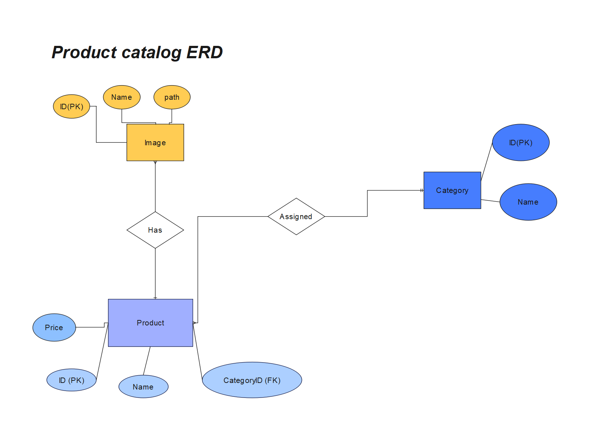

# BE riesenie

* [Zadanie](DOCS/ASSIGNMENT.md)
* [ER diagram](DOCS/ERD.png)
* [SQL](DOCS/SQL.md)



## Endpointy

* **[GET]** ```/api/products``` listing produktov
* **[POST]** ```/api/products``` tvorba produktu
* **[GET]** ```/api/products/{id}``` detail produktu
* **[PATCH]** ```/api/products/{id}``` editacia produktu